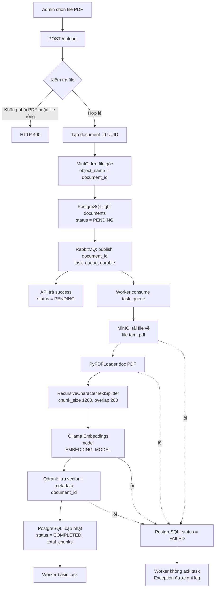

# RAG - Luồng admin upload tài liệu

Tài liệu này mô tả luồng admin tải tài liệu PDF lên hệ thống RAG và quá trình lập chỉ mục tài liệu để phục vụ tìm kiếm/ngữ cảnh cho chatbot.

## Tổng quan

Luồng upload được tách thành hai phần:

1. **API upload** tiếp nhận file, lưu bản gốc và tạo task xử lý.
2. **Worker** xử lý task bất đồng bộ: tải file, tách nội dung, tạo embedding và lưu vector.

Nhờ đó, API có thể trả kết quả ngay sau khi tài liệu được tiếp nhận, thay vì phải chờ toàn bộ quá trình embedding hoàn tất.

## Sơ đồ dữ liệu



## Chi tiết từng bước

### 1. Admin gọi API upload

Endpoint:

```http
POST /upload
Content-Type: multipart/form-data
```

Field bắt buộc là `file`.

API kiểm tra:

- `file.content_type` phải là `application/pdf`.
- Nội dung file không được rỗng.

Nếu hợp lệ, API đọc file vào bộ nhớ và tạo `document_id` bằng UUID. ID này được dùng thống nhất ở MinIO, PostgreSQL, RabbitMQ và Qdrant.

### 2. Lưu file gốc vào MinIO

File PDF được lưu vào bucket cấu hình bởi `BUCKET_NAME`.

| Thành phần | Giá trị |
| --- | --- |
| Bucket | `BUCKET_NAME`, mặc định `documents` |
| Object name | `document_id` |
| Content type | `application/pdf` |

Tên file gốc không dùng làm object name. Tên file được giữ trong PostgreSQL qua trường `file_name`.

### 3. Ghi metadata và trạng thái vào PostgreSQL

Bản ghi được tạo trong bảng `documents` với các thông tin chính:

- `id`: `document_id`.
- `file_name`: tên file admin tải lên.
- `file_size_bytes`: kích thước file.
- `minio_bucket`: bucket chứa file.
- `status`: `PENDING`.

Nếu ID đã tồn tại, logic `ON CONFLICT` đặt trạng thái về `PENDING` và cập nhật `updated_at`.

Các trạng thái được khai báo trong database:

| Trạng thái | Ý nghĩa |
| --- | --- |
| `PENDING` | Đã nhận file, đang chờ worker xử lý |
| `PROCESSING` | Đã khai báo trong schema, hiện chưa được set trong code worker |
| `COMPLETED` | Đã tạo embedding và lưu thành công vào Qdrant |
| `FAILED` | Xử lý tài liệu thất bại |

### 4. Gửi task vào RabbitMQ

API publish `document_id` vào queue bền vững `task_queue`. Message được cấu hình `delivery_mode=2` để message được ghi bền vững.

Payload của message chỉ là chuỗi UUID, không chứa nội dung file:

```text
<document_id>
```

Sau khi publish thành công, API trả về:

```json
{
  "success": true,
  "document_id": "<uuid>",
  "file_name": "tai-lieu.pdf",
  "status": "PENDING",
  "message": "Đã tải lên tai-lieu.pdf, đang xử lý"
}
```

### 5. Worker nhận và xử lý task

`backend/worker.py` consume queue `task_queue`. Với mỗi message, worker:

1. Decode `document_id`.
2. Gọi `done_admin(document_id)`.
3. Chỉ `ack` message sau khi `done_admin` hoàn tất thành công.

Trong `done_admin`, hệ thống tải object từ MinIO về một file PDF tạm trên máy worker. File tạm được xóa trong `finally` sau khi xử lý xong hoặc thất bại.

### 6. Đọc, chia nhỏ và vector hóa nội dung

Hàm `LCE` thực hiện:

1. `PyPDFLoader` đọc nội dung PDF.
2. `RecursiveCharacterTextSplitter` chia tài liệu thành các chunk:
   - `chunk_size = 1200`
   - `chunk_overlap = 200`
   - lưu `start_index` của chunk.
3. Gắn `document_id` vào metadata của từng chunk.
4. Tạo embedding bằng Ollama với `EMBEDDING_MODEL`.
5. Ghi các vector vào collection Qdrant `COLLECTION_NAME`.

Sau khi Qdrant nhận thành công, PostgreSQL cập nhật:

```text
status = COMPLETED
total_chunks = số chunk đã tạo
```

### 7. Xử lý lỗi và rollback

#### Lỗi kiểm tra đầu vào

API trả `HTTP 400` nếu file không phải PDF hoặc file rỗng. Không tạo document và không gửi task.

#### Lỗi sau khi đã lưu MinIO

Nếu bước ghi database hoặc publish RabbitMQ thất bại, API cố gắng xóa object vừa lưu trên MinIO rồi trả `HTTP 500`.

#### Lỗi trong worker

Nếu tải file, đọc PDF, tạo embedding hoặc ghi Qdrant thất bại:

- Worker cập nhật document thành `FAILED` trong PostgreSQL.
- Lỗi được ghi ra log.
- Worker không gọi `basic_ack`, nên message chưa được xác nhận thành công.

## Các thành phần liên quan

| Thành phần | Vai trò |
| --- | --- |
| FastAPI | Nhận request upload và điều phối các bước đầu tiên |
| MinIO | Lưu file PDF gốc |
| PostgreSQL | Lưu metadata, trạng thái và số lượng chunk |
| RabbitMQ | Hàng đợi task xử lý bất đồng bộ |
| Worker | Thực hiện ingestion và embedding |
| Ollama | Cung cấp model embedding |
| Qdrant | Lưu và tìm kiếm vector tài liệu |

## Cấu hình cần kiểm tra

Các biến môi trường được đọc từ `.env`, bao gồm:

- PostgreSQL: `POSTGRES_HOST`, `POSTGRES_PORT`, `POSTGRES_DB`, `POSTGRES_USER`, `POSTGRES_PASSWORD`.
- MinIO: `MINIO_HOST`, `MINIO_PORT`, `MINIO_ROOT_USER`, `MINIO_ROOT_PASSWORD`, `BUCKET_NAME`.
- RabbitMQ: `RABBITMQ_HOST`, `RABBITMQ_PORT`, `RABBITMQ_USER`, `RABBITMQ_PASSWORD`.
- Qdrant: `QDRANT_HOST`, `QDRANT_PORT`, `COLLECTION_NAME`.
- Ollama: `EMBEDDING_MODEL`.

Các dịch vụ hạ tầng có thể khởi động bằng:

```powershell
docker compose up -d
```

API và worker cần được chạy riêng trong môi trường Python của backend.

## Lưu ý khi vận hành

- API trả `PENDING` trước khi biết kết quả embedding cuối cùng; trạng thái hoàn tất cần được đọc từ PostgreSQL.
- Worker cần chạy liên tục để tiêu thụ `task_queue`.
- Qdrant collection được khởi tạo khi `backend/main.py` được import nếu collection chưa tồn tại.
- Code upload hiện tại nên khởi tạo biến `minio_uploaded = False` trước khối `try`, để tránh lỗi phụ khi `upload_minIO` thất bại ngay từ đầu và nhánh xử lý exception tham chiếu biến chưa được gán.
